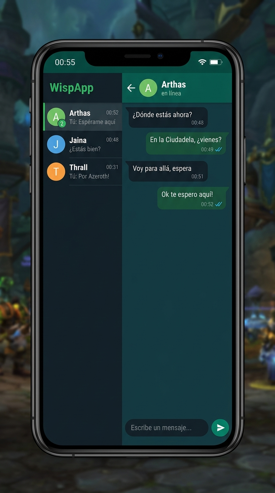

# ?? WispCraft — WispCraft para WoW Forever

> **WhatsApp-style whisper interface for World of Warcraft: Forever**
> Build target: `12.1.0 · Interface 120100 · Midnight Modern API`



---

## ? ¿Qué es WispCraft?

WispCraft convierte los susurros (*whispers / wisps*) de WoW en una interfaz de chat estilo **WhatsApp Dark**, flotante y arrastrable sobre la pantalla del juego.

- Cada jugador que te susurra tiene su propia **conversación con burbujas**
- Los mensajes entrantes aparecen a la izquierda (teal oscuro) y los salientes a la derecha (verde WA)
- Incluye **lista de contactos** con previsualizaciones, timestamps y badges de no leídos
- Se integra con el chat nativo: cualquier `/susurro` que mandes desde el chat estándar también aparece aquí

---

## ??? Preview

| Elemento | Descripción |
|---|---|
| **WispCraft** | Header lateral verde con el nombre del addon |
| **Lista de contactos** | Sidebar izquierdo con avatar inicial, preview del último mensaje, hora y badge de no leídos |
| **Conversación** | Panel derecho con burbujas, doble tick ?? en mensajes enviados |
| **Input** | Campo de texto con placeholder + botón enviar verde |
| **Status bar** | Barra superior simulando un teléfono real (hora, batería) |

---

## ?? Estructura del Proyecto

```
WispCraft/
¦
+-- WispCraft.toc              ? Manifiesto del addon (Interface: 120100)
+-- WispCraft.lua              ? Lógica principal + UI completa
¦
+-- docs/
¦   +-- preview.jpg           ? Mockup visual de la interfaz
¦
+-- libs/
¦   +-- (librerías externas futuras, ej: LibStub, AceDB)
¦
+-- .vscode/
¦   +-- settings.json         ? Configuración del workspace VS Code
¦   +-- extensions.json       ? Extensiones recomendadas
¦
+-- CHANGELOG.md              ? Historial de versiones
+-- README.md                 ? Este archivo
```

---

## ?? Instalación

### Método manual
```
1. Copia la carpeta WispCraft/ completa en:
   _retail_\Interface\AddOns\WispCraft\

2. Inicia WoW (o /reload si ya está abierto)

3. Activa el addon en el menú de Addons del selector de personaje
```

### Verificar versión de interfaz
Si WoW muestra el addon como "desactualizado", confirma el número correcto:
```lua
-- En el chat de WoW:
/dump select(4, GetBuildInfo())
-- Actualiza ## Interface: XXXXXX en WispCraft.toc con ese número
```

---

## ?? Uso

### Comandos

| Comando | Acción |
|---|---|
| `/WispCraft` o `/wc` | Abre / cierra el teléfono |
| `/wc reset` | Resetea la posición al centro |

### Botón del minimapa
- Aparece un botón ?? en el borde del minimapa (posición 220°)
- Clic izquierdo ? abre/cierra WispCraft

### Flujo de uso
1. Alguien te susurra ? **WispCraft se abre automáticamente**
2. La conversación aparece seleccionada con las burbujas
3. Escribe en el campo de texto y pulsa **Enter** o el botón **?**
4. Si tienes varios susurros pendientes, el badge verde muestra cuántos no leídos hay
5. Haz clic en un contacto del sidebar para cambiar de conversación

---

## ?? Restricciones del API (Midnight / WoW Forever)

WoW: Forever usa las **Midnight Modern API restrictions**. WispCraft respeta estas reglas:

| API | Estado | Nota |
|---|---|---|
| `CHAT_MSG_WHISPER` | ? Permitido | Evento de susurro entrante |
| `CHAT_MSG_WHISPER_INFORM` | ? Permitido | Evento de susurro saliente |
| `SendChatMessage("msg", "WHISPER", ...)` | ? Permitido | Envío de susurros |
| `CreateFrame`, `ScrollFrame` | ? Permitido | UI customization total |
| `SavedVariables` (posición) | ? Permitido | Persistencia entre sesiones |
| Datos de combate internos | ? Bloqueado | No usado — fuera de scope |

> **WispCraft es 100% compatible con las Midnight API restrictions** porque solo
> trabaja con el sistema de chat, sin tocar datos de combate, cooldowns ni buffs.

---

## ?? Diseño y Tema

### Paleta de colores (WhatsApp Dark)

| Token | Hex aproximado | Uso |
|---|---|---|
| `hdr` | `#12:8F:61` | Header y botón enviar |
| `hdrDark` | `#0B:66:40` | Header sidebar |
| `bOut` | `#12:5C:3F` | Burbujas salientes |
| `bIn` | `#22:32:38` | Burbujas entrantes |
| `screen` | `#12:1F:27` | Fondo de chat |
| `sidebar` | `#0D:11:15` | Fondo sidebar |
| `badge` | `#12:8F:61` | Badge de no leídos |

### Avatares
Los avatares de contacto usan la **inicial del nombre** con un color generado deterministamente a partir del hash del nombre, garantizando que cada jugador siempre tenga el mismo color.

---

## ??? Roadmap — Features pendientes

### v1.1 — Persistencia
- [ ] Guardar conversaciones en `SavedVariables` entre sesiones
- [ ] Historial persistente (últimos N mensajes por contacto)
- [ ] Configuración de cuántos mensajes guardar

### v1.2 — UX
- [ ] Notificación flash en el título de la ventana
- [ ] Emojis de WoW (`:)` ? ?? auto-conversión)
- [ ] Búsqueda en conversaciones (`/wc search <texto>`)
- [ ] Silenciar a un contacto específico

### v1.3 — Estilo avanzado
- [ ] Modo claro (WhatsApp Light)
- [ ] Marcos redondeados con `Backdrop` mejorado
- [ ] Foto de perfil basada en la clase del personaje (usando texturas de WoW)
- [ ] Animación de typing dots "..."

### v1.4 — Integración
- [ ] Slash command rápido: `/w <nombre> <mensaje>` desde WispCraft
- [ ] Integración con el sistema de amigos de BNet
- [ ] Botón para exportar historial al chat principal

### v2.0 — Multi-canal *(requiere investigación de API)*
- [ ] Soporte para canales de guild como "conversaciones de grupo"
- [ ] Vista de grupo (guild officer, etc.)

---

## ??? Desarrollo

### Requisitos
- **VS Code** con extensiones recomendadas (ver `.vscode/extensions.json`)
- WoW instalado con `_retail_` activo

### Setup del entorno
```bash
# Ruta de desarrollo (symlink recomendado en Windows):
mklink /D "C:\Program Files (x86)\World of Warcraft\_retail_\Interface\AddOns\WispCraft" "C:\ruta\al\proyecto\WispCraft"
```

### Ciclo de desarrollo
```lua
-- 1. Editar WispCraft.lua en VS Code
-- 2. En WoW: /reload
-- 3. Probar susurros con /w <tuOtroPersonaje> <mensaje>
-- 4. Para debug:
/dump WispCraftDB              -- ver datos guardados
/script WispCraftPhone:Show()  -- mostrar el frame a mano
/wc reset                     -- resetear posición
```

### Arquitectura del código

```
WispCraft.lua
¦
+-- CONSTANTS & THEME     -- Paleta de colores, tamaños de layout
+-- STATE                 -- convos[], unread[], contacts[], active
+-- HELPERS               -- ts(), me(), stripRealm(), pushMessage()
+-- MEASUREMENT           -- measureH(), measureW() (FontString oculto)
+-- BUBBLE FACTORY        -- newBubble(), clearBubbles()
+-- RENDER CHAT           -- renderChat() — re-renders all bubbles
+-- CONTACT ROW FACTORY   -- buildContactRow()
+-- UPDATE CONTACT LIST   -- updateContactList()
+-- SELECT CONTACT        -- selectContact()
+-- SEND WHISPER          -- doSend() + pendingOut dedup
+-- BUILD UI              -- buildUI() — construye todos los frames
+-- MINIMAP BUTTON        -- buildMinimapButton()
+-- EVENT HANDLER         -- ADDON_LOADED, CHAT_MSG_WHISPER, CHAT_MSG_WHISPER_INFORM
+-- SLASH COMMANDS        -- /WispCraft, /wc
```

### Convenciones de código
- **Namespacing**: todo privado en `local`. Solo `WispCraftDB` y frames nombrados son globales.
- **Dedup de mensajes salientes**: `pendingOut[target][msg]` evita duplicados entre el push optimista y el evento `CHAT_MSG_WHISPER_INFORM`.
- **Medición de texto**: Un frame oculto con `FontString` mide el alto/ancho antes de crear cada burbuja, garantizando layout correcto.
- **No hay cooldowns ni datos de combate**: 100% dentro de las Midnight API restrictions.

---

## ?? Referencias API usadas

| API | Descripción |
|---|---|
| [`CHAT_MSG_WHISPER`](https://warcraft.wiki.gg/wiki/CHAT_MSG_WHISPER) | Evento susurro entrante |
| [`CHAT_MSG_WHISPER_INFORM`](https://warcraft.wiki.gg/wiki/CHAT_MSG_WHISPER_INFORM) | Evento susurro saliente |
| [`SendChatMessage`](https://warcraft.wiki.gg/wiki/API_SendChatMessage) | Enviar mensaje |
| [`CreateFrame`](https://warcraft.wiki.gg/wiki/API_CreateFrame) | Crear frames de UI |
| [`C_Timer.After`](https://warcraft.wiki.gg/wiki/API_C_Timer.After) | Timer async (scroll to bottom) |
| [`C_Timer.NewTicker`](https://warcraft.wiki.gg/wiki/API_C_Timer.NewTicker) | Ticker para el reloj |
| [`PlaySound`](https://warcraft.wiki.gg/wiki/API_PlaySound) | Sonido de notificación |
| [`UnitName`](https://warcraft.wiki.gg/wiki/API_UnitName) | Nombre del jugador |
| [`SavedVariables`](https://warcraft.wiki.gg/wiki/Saving_variables_between_game_sessions) | Persistencia |
| [FrameXML Live (69814)](https://www.townlong-yak.com/framexml/live) | Referencia UI Blizzard |

---

## ?? Licencia

MIT License — Libre para uso, modificación y distribución.
Addon creado para **WoW: Forever** con Midnight Modern API.

---

*Generado con Antigravity · WoW Forever Build 12.1.0 (69814) · Septiembre 2026*
